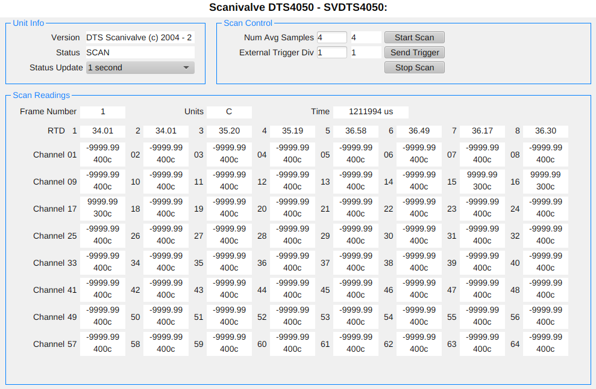

# Scanivalve DTS4050 IOC

An [EPICS](https://epics-controls.org) [StreamDevice](https://paulscherrerinstitute.github.io/StreamDevice/)
IOC for the Scanivalve DTS4050 Digital Temperature Scanner.

A manual can be found in the [docs](docs/DTS4050_V203.pdf) folder.

## EPICS Dependencies

* [base](https://github.com/epics-base/epics-base)
* [asyn](https://github.com/epics-modules/asyn)
* [autosave](https://github.com/epics-modules/autosave)
* [StreamDevice](https://github.com/paulscherrerinstitute/StreamDevice)
